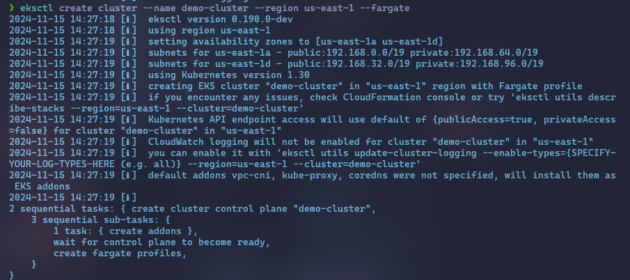

# Assignment Documentation

## Question 1

#### 1.1 THis is q1 dsifsidfoisdf fiedsoifjisdf sfjsd 
   - Explanation and steps for solving the problem.
   

#### 1.2 his dsdsd 
   - Explanation and steps for solving the problem.
   

## Question 2

### 2.1
   - Explanation and steps for solving the problem.
   

### 2.2
   - Explanation and steps for solving the problem.
   

## Question 3

### 3.1
   - Explanation and steps for solving the problem.
   

### 3.2
   - Explanation and steps for solving the problem.
   

## Question 4

### 4.1
   - Explanation and steps for solving the problem.
   

### 4.2
   - Explanation and steps for solving the problem.
   

## Question 5

### 5.1
   - Explanation and steps for solving the problem.
   

### 5.2
   - Explanation and steps for solving the problem.
   
